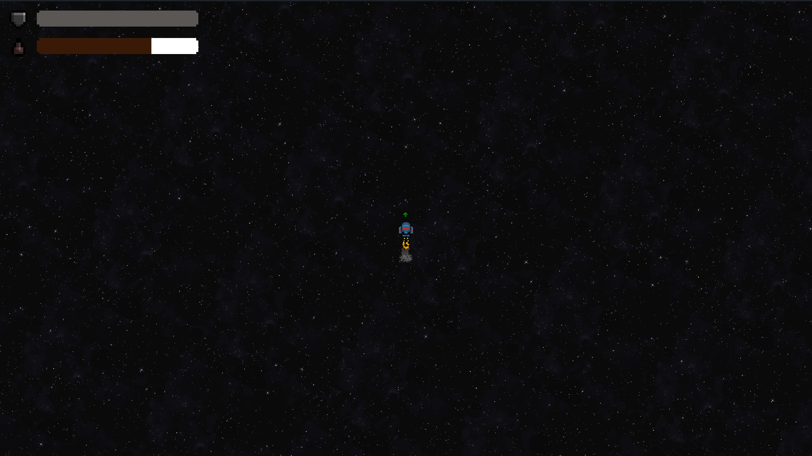
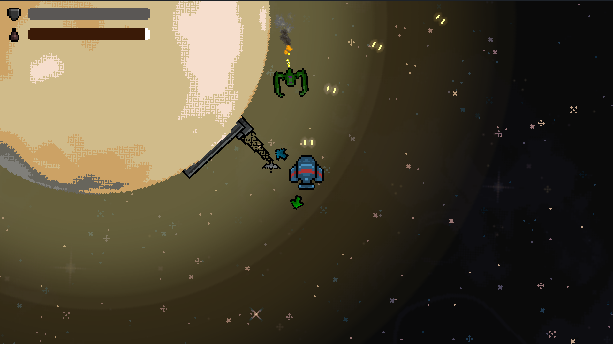
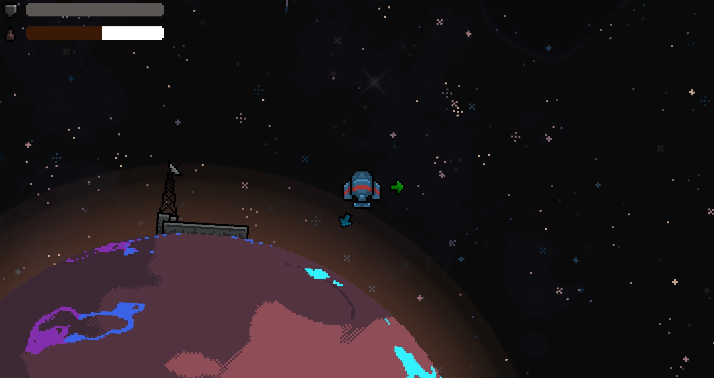

+++
title = "A New Home"
date = "2023-08-01"
extra = {icon = "icon350x350.png", header_image_paths = ["'/games/a-new-home/screenshots/01.png', '/games/a-new-home/screenshots/02.png', '/games/a-new-home/screenshots/03.jpg'"], header_title = "", bar_icon = "/icon_border_blue.png", body_class = "erebus-page", back_to_top_button = "/go_up_button_blue.png", top_bar_elements = [{link = "#Features", text = "Features"}, {link = "#Screenshots", text = "Screenshots"}, {link = "#Available on", text = "Available on"}]}
+++

We made this game in 2 days for the Striked Game Jam 2023.

# Features

- Find a new habitable planet
- Fight dangers along the way: stars, gas giants, enemies, and asteroids
- Repair your ship or refill his fuel on other planets

# Screenshots

    
    
    

# Available on:

    
    
    

 
 

    
     

