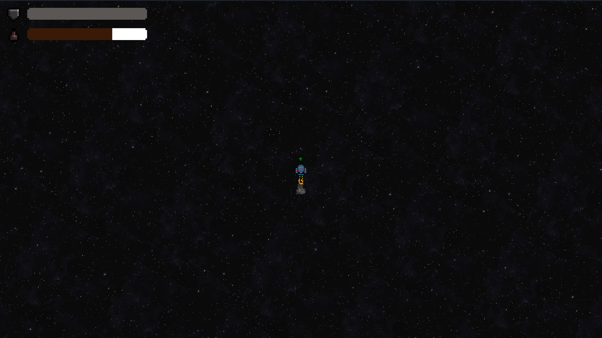
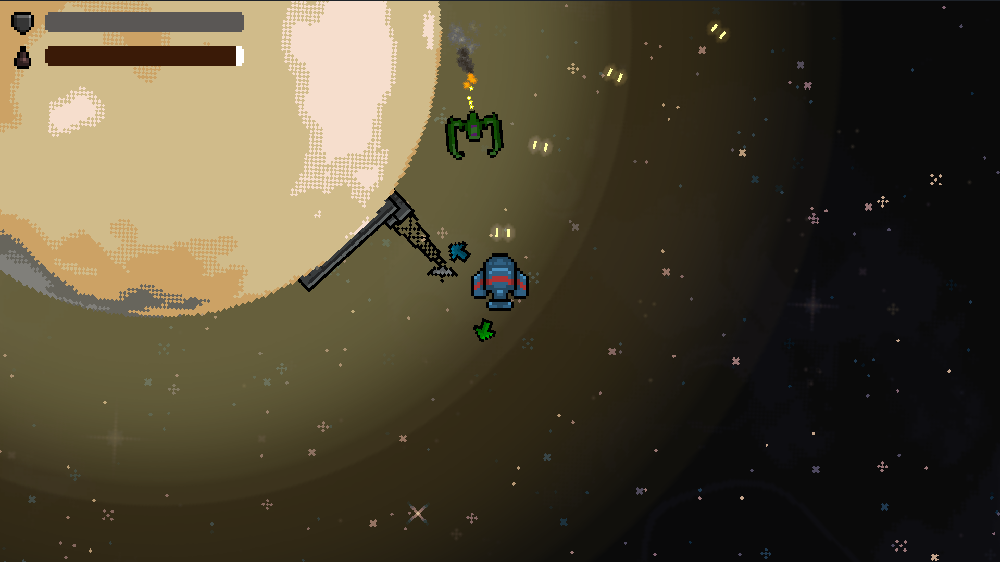
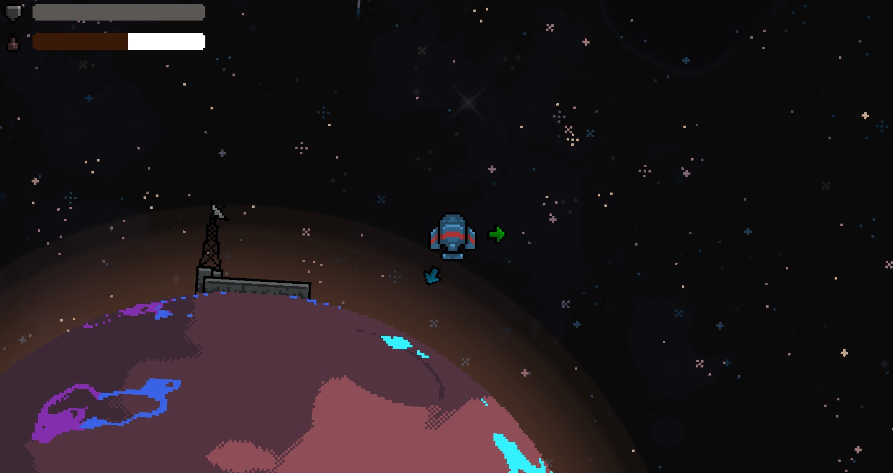

+++
title = "A New Home"
date = "2023-08-01"
extra = {icon = "", header_image = "", header_title = "", bar_icon = "/icon_border_blue.png", body_class = "erebus-page", back_to_top_button = "/go_up_button_blue.png", top_bar_elements = ["features", "screenshots", "artwork", "available_on", "contact_or_follow"]}
+++

# Captures de pantalla

    
    
    
  <!--   
    
    
    
    
    
    
    
     -->

