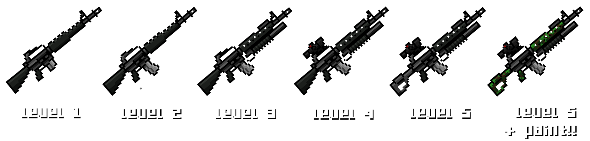
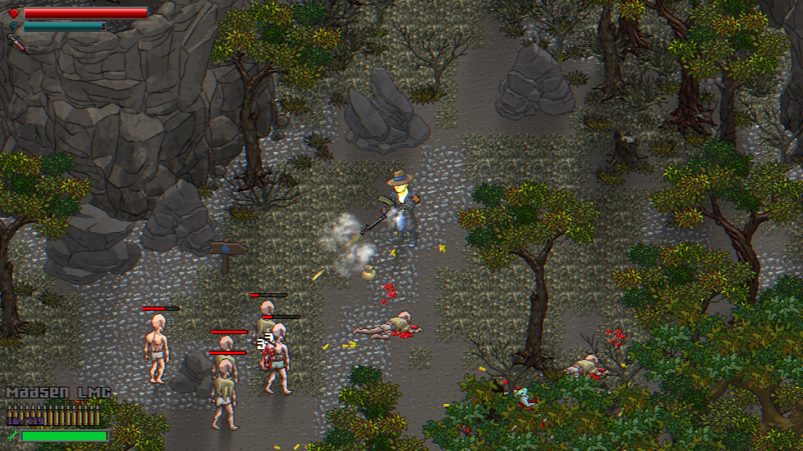
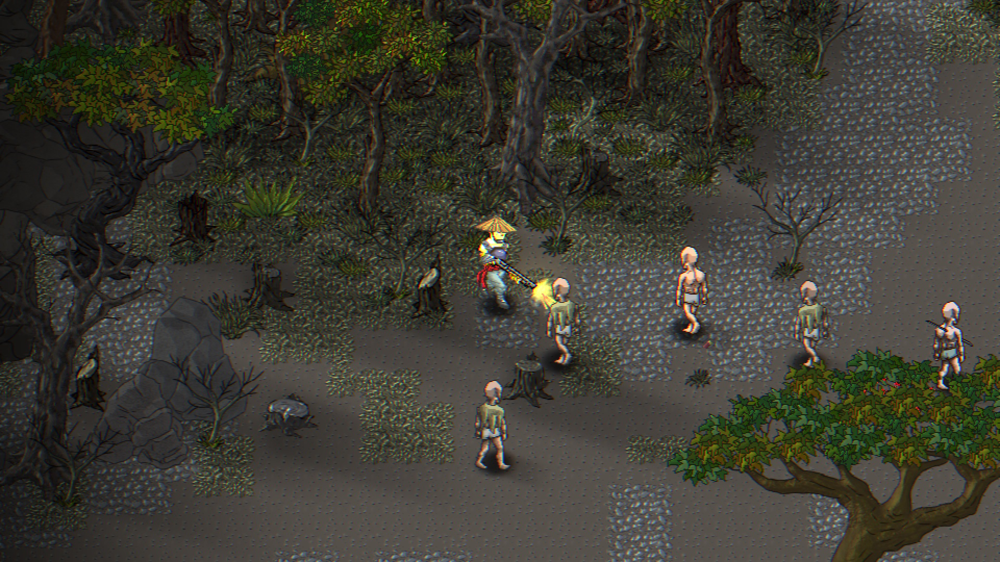
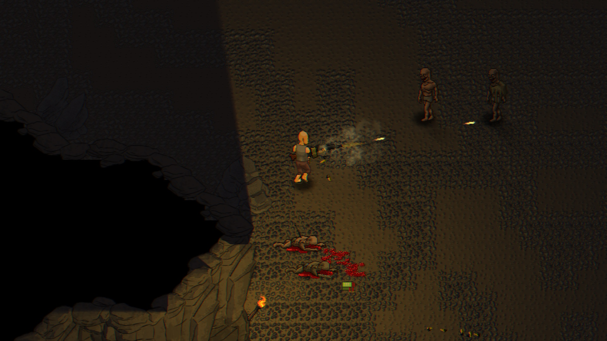

+++
title = "Erebus"
date = "2022-11-25"
extra = {icon = "/erebus_icon.jpg", header_image = "/erebus_title.png", header_title = "/web_header_erebus.png", bar_icon = "/icon_border_blue.png", body_class = "erebus-page", back_to_top_button = "/go_up_button_blue.png", top_bar_elements = ["features", "screenshots", "download_demo", "available_on", "contact_or_follow"]}
+++

**IMPORTANT**: El joc encara està en desenvolupament, algunes de les característiques s'aniran implementant o poden canviar en el futur.

Erebus és una aventura d'acció amb elements de rol.

Submergeix-te en un món hostil alhora que misteriós i descobreix les raons que t'han portat a Erebus.

# Característiques

- Combat perilloses criatures que requereixen diferents estratègies i atacs.

- Busca i troba respostes en un món que es va revelant a mesura que el recorres, gràcies a una campanya que es genera dinàmicament segons les teves decisions.
- Troba, repara, i millora una gran varietat d'armes.

- Descobreix diferents armadures amagades al voltant del món, cada una amb els seus avantatges i desavantatges que canviaran el teu estil de joc.

- Varietat de NPCs, cada un amb la seva pròpia història, rerefons i objectius; no ets cap elegit, només una persona més en aquest món.

- Diferents ambients i escenaris que posaran a prova les teves capacitats.
- Decisions sobre la història portaran a diferents resultats o finals; no només els teus diàlegs, sinó també les teves accions tindran conseqüències...

# Captures de pantalla

    
    
    
    
    
    
    
    
    
    
    
    

# Descarga la demo

    
    

# Disponible a:

bla bla bla

# Contacte amb nosaltres o segueix-nos
