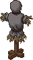
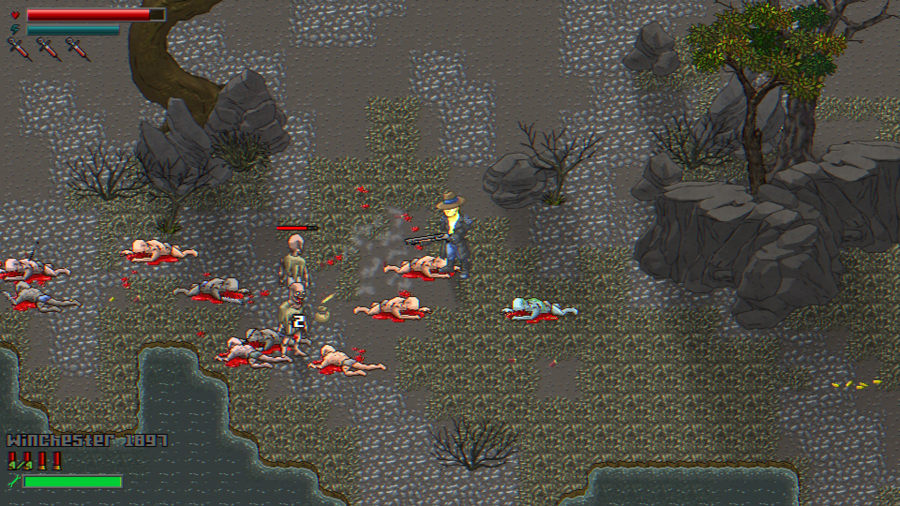
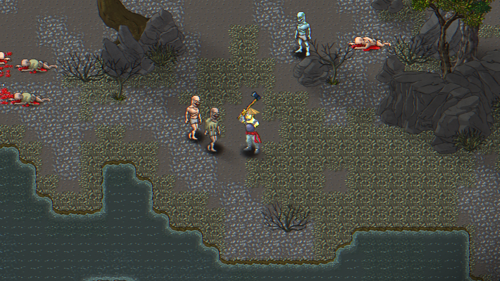
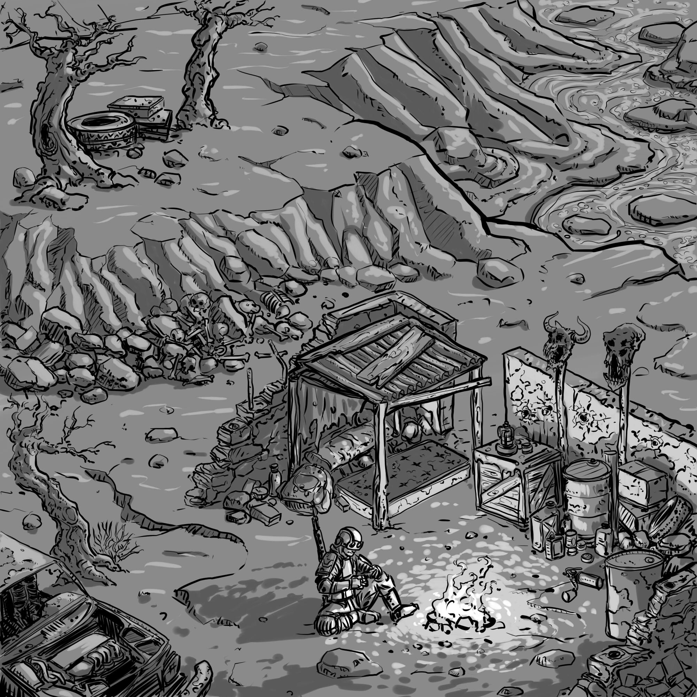
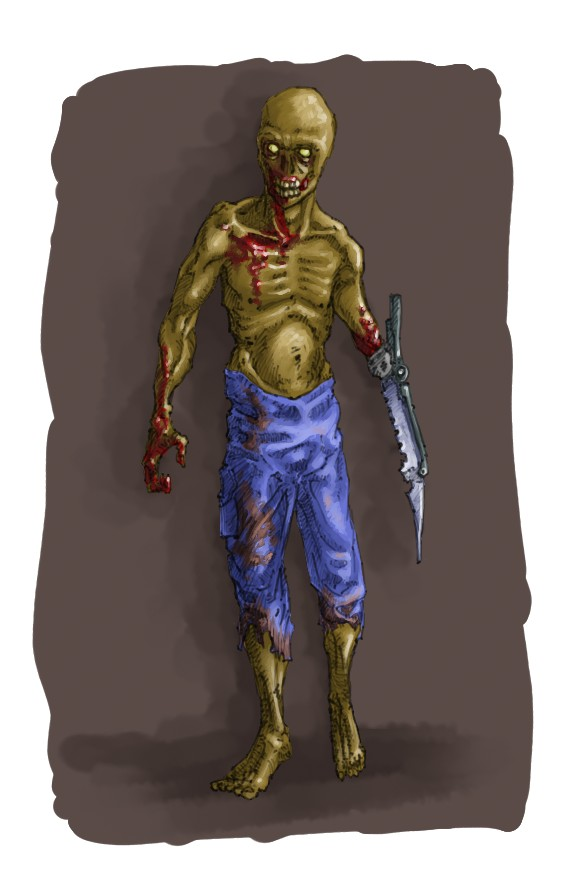
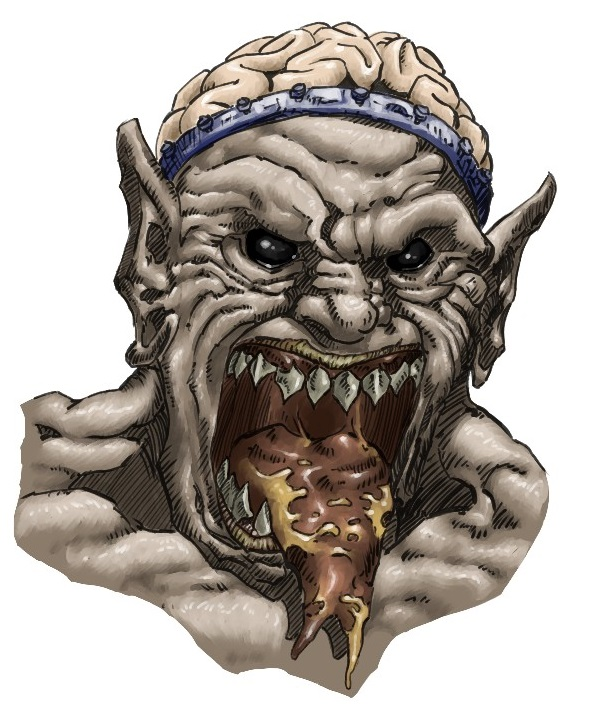

+++
title = "Erebus"
date = "2022-11-25"
extra = {icon = "/erebus_icon.jpg", header_image_paths = ['"/games/erebus/screenshots/07.jpg", "/games/erebus/screenshots/08.jpg", "/games/erebus/screenshots/09.jpg", "/games/erebus/screenshots/10.jpg", "/games/erebus/screenshots/12.jpg", "/header_images/erebus/corte_01.jpg", "/header_images/erebus/corte_02.jpg", "/header_images/erebus/corte_03.jpg", "/header_images/erebus/corte_05.jpg", "/header_images/erebus/corte_06.jpg"'], header_title = "/web_header_erebus.png", bar_icon = "/icon_border_blue.png", body_class = "erebus-page", back_to_top_button = "/go_up_button_blue.png", top_bar_elements = [{link = "#Características", text = "Características"}, {link = "#Capturas", text = "Capturas"}, {link = "#Arte conceptual", text = "Arte conceptual"}, {link = "#Disponible en", text = "Disponible en"}, {link = "#Contáctanos o síguenos", text = "Contáctanos o síguenos"}]}
+++

**IMPORTANTE**: El juego aún está en desarrollo, algunas de estas características se irán implementando o pueden cambiar en el futuro.

Erebus es una aventura de acción con elementos de rol.

Sumérgete en un mundo hostil a la par que misterioso y descubre los motivos que te llevaron a Erebus.

# Características

- Combate con peligrosas criaturas que requieren diferentes estrategias y ataques.

- Busca y encuentra respuestas en un mundo que se va desvelando a medida que lo recorres, gracias a una campaña que se genera dinámicamente según tus decisiones.
- Encuentra, repara, y mejora una gran variedad de armas.

- Descubre diferentes armaduras escondidas alrededor del mundo, cada una con sus ventajas y desventajas que cambiarán tu estilo de juego.

- Variedad de NPC’s cada uno con su propia historia, trasfondo y objetivos; no eres ningún elegido, solo uno más en este mundo.

- Diversos ambientes y escenarios que pondrán a prueba tus capacidades.
- Decisiones en la historia que llevan a diferentes resultados o finales; no sólo tus diálogos, sino también tus acciones tendrán consecuencias...

# Capturas

    
    
    
    
    
    
    
    
    
    
    
    

# Arte conceptual

    
    
    
    
    
    

# Disponible en:

    
    

 
 

    

# Contáctanos o síguenos

{{ social_networks_list() }}